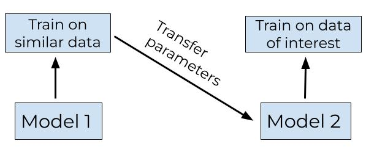
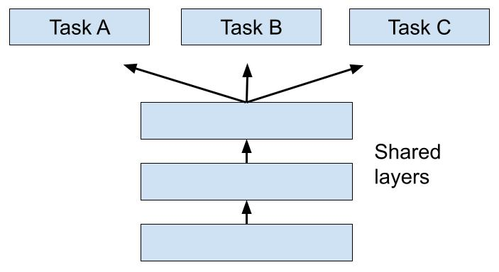
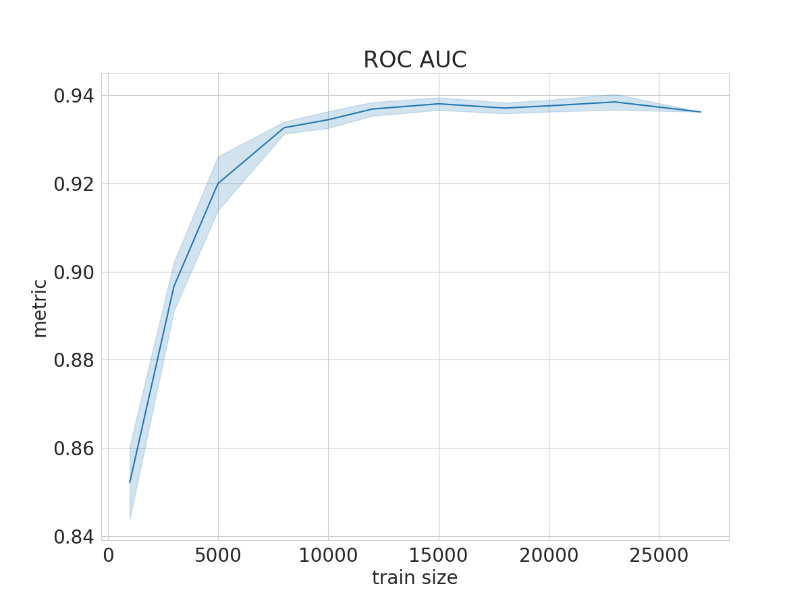
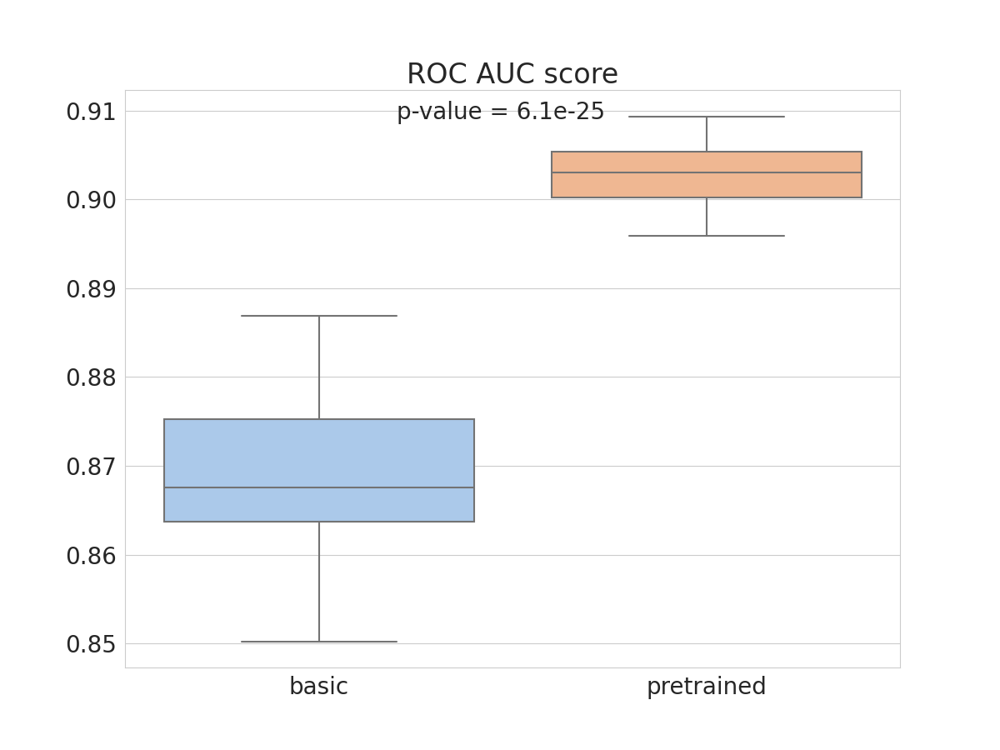
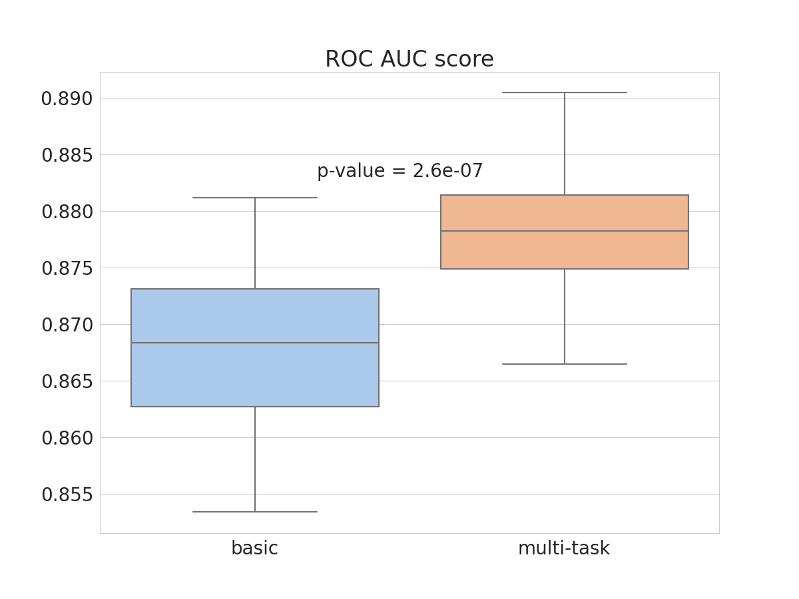

# Amino_acid_transfer_learning_for_antibody_binding_prediction

## Background
Taft and colleagues ([J. M. Taft, et al., 2022](https://www.ncbi.nlm.nih.gov/pmc/articles/PMC9428596/)) created mutagenesis libraries of RBD domain of SARS-CoV-2 spike protein. RBD variants were expressed on the yeast surface as a C-terminal fusion to another protein. Binding to ACE2 and 4 therapeutic antibodies was measured.
Machine learning models predicted ACE2 binding and antibody escape. Models tested included KNN, Log Reg, naive Bayes, SVMs, RFs; RNNs. RF and RNN models showed the best metrics.
For ACE2 and each antibody separate models were trained to predict binding/escape.

## Purpose
Minimize the size of a train dataset with transfer learning or other methods.

## Methods

### Transfer-learning
Transfer learning is used in tasks where a big amount of data cannot be collected for some reason. In this approach, knowledge from one task is transferred to the current task. In this work, we used a dataset of ACE2 binding to mutated sequences as a pretraining dataset before training the model on datasets with neutralizing antibodies.

### Multi-task
Multi-task is a machine learning approach where the same information is used for multiple tasks. In current work, predicting escape from different antibodies for the same RBD sequence is considered as "multiple task".

## Results
### Dependence of ROC AUC on train size
ROC AUC depends on size of train set. It grows with the increase of the train dataset, but then reaches a plateau.

Mean ± SD, n = 20.

### LSTM vs pre-trained LSTM
Pretraining on ACE2 improves metrics, but the increase is small.

T-test for two related samples, n=40. 

### LSTM vs Multi-task LSTM
Simultaneous training on other antibodies with multi-task approach improves metrics, but the increase is still small.

T-test for two related samples, n=40. 

## Data and packages
### Training and test data

All trainand test data used in this project is stored in **data** directory.

### Functions and classes

All reusable and non-interactive code is stored in **src** package.

## Usage

### Launch notebook copy in Google Colab (web)
Transfer-learning:

https://github.com/NatashaKhotkina/Amino_acid_transfer_learning_for_antibody_binding_prediction/blob/main/Transfer_learning_for_AB_binding_prediction.ipynb

Multi-task:

https://github.com/NatashaKhotkina/Amino_acid_transfer_learning_for_antibody_binding_prediction/blob/main/Multi_task_for_AB_binding_prediction.ipynb